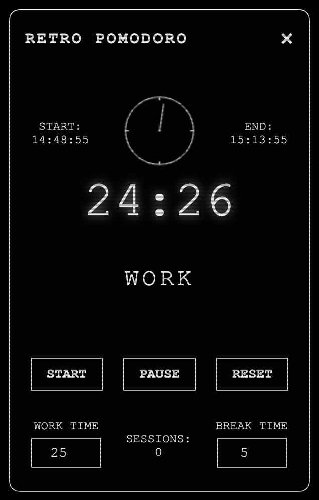
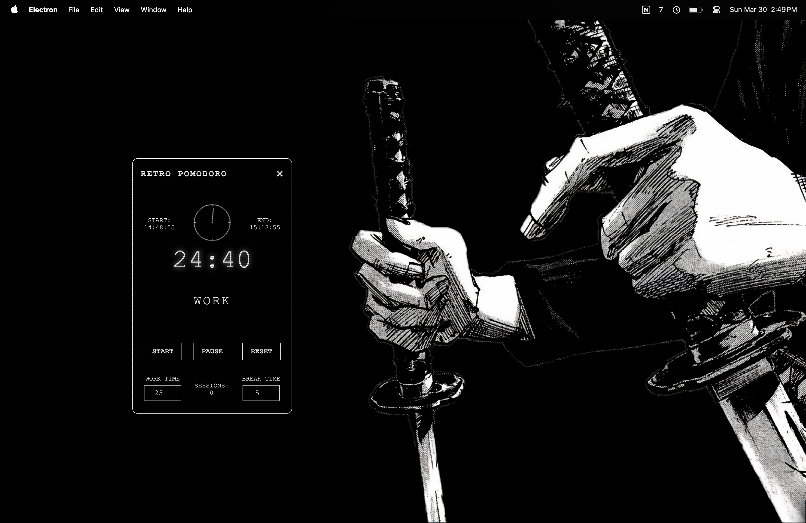

# RetroPomodoro

A minimalist, black and white Pomodoro timer application with a retro aesthetic. RetroPomodoro helps you maintain focus and productivity using the Pomodoro Technique with a stylish, distraction-free interface.



## Features

- **Clean Retro Design**: Minimalist black and white interface with CRT screen effects
- **Analog + Digital Display**: Shows both an analog clock visualization and a digital timer
- **Start/End Time Display**: See when your current session began and when it will end
- **Work/Break Modes**: Automatically switches between work and break periods
- **Customizable Durations**: Set your preferred work and break times
- **Session Tracking**: Keeps count of completed Pomodoro sessions
- **Desktop Notifications**: Receive alerts when a timer completes
- **Frameless Window**: Clean, borderless interface that stays out of the way

## Screenshots

<div align="center">
  
  
</div>

## Installation

### Prerequisites
- Node.js (v14.0.0 or higher)
- npm (v6.0.0 or higher)

### Setup
1. Clone the repository:
   ```
   git clone https://github.com/yourusername/retropomodoro.git
   cd retropomodoro
   ```

2. Install dependencies:
   ```
   npm install
   ```

3. Run the application:
   ```
   npm start
   ```

### Build for your platform
```
npm run package
```

This will create executable files for your operating system in the `dist` folder.

## How to Use

1. **Set your timers**: Adjust "WORK TIME" and "BREAK TIME" as needed
2. **Start a session**: Click the "START" button to begin a work session
3. **Pause if needed**: Click "PAUSE" to temporarily stop the timer
4. **Reset anytime**: Click "RESET" to start over
5. **Track sessions**: The session counter increases after each completed work period
6. **Desktop notifications**: Receive alerts when it's time to switch between work and break

## The Pomodoro Technique

The Pomodoro Technique is a time management method developed by Francesco Cirillo in the late 1980s. The technique uses a timer to break work into intervals, traditionally 25 minutes in length, separated by short breaks. Each interval is known as a "pomodoro," the Italian word for tomato (after the tomato-shaped kitchen timer Cirillo used as a university student).

## Technical Details

RetroPomodoro is built with:
- Electron.js for cross-platform desktop functionality
- HTML, CSS, and JavaScript for the interface
- Canvas API for the analog clock visualization

## License

This project is licensed under the MIT License - see the LICENSE file for details.

## Acknowledgments

- Inspired by the Pomodoro Technique by Francesco Cirillo
- Built with love for productivity enthusiasts and retro design fans
